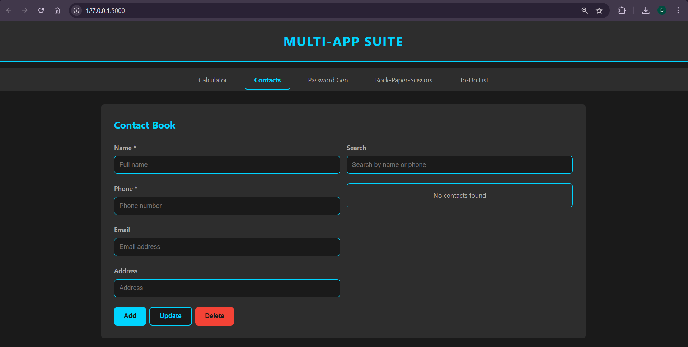
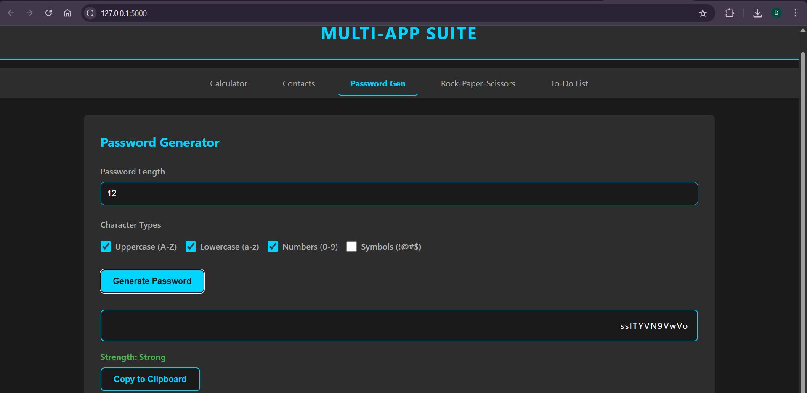
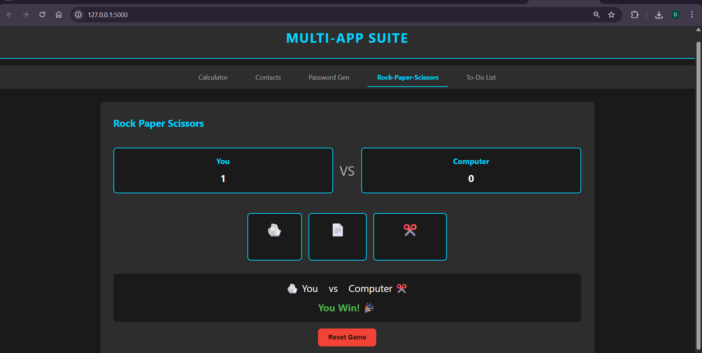
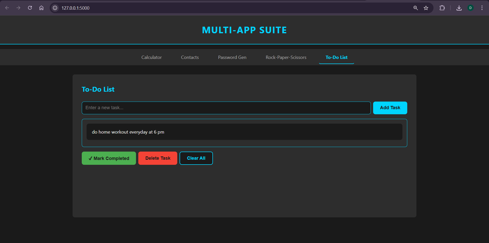

# CODSOFT Python Programming Internship

This repository contains all 5 completed tasks for the CODSOFT Python Programming Internship, now integrated into a **unified web application** built with Flask and vanilla JavaScript.

## 🚀 Live Web App

All 5 applications are accessible from a single website with a consistent dark-themed UI, responsive design, and persistent data storage.

### How to Run

```bash
# Install dependencies
pip install flask flask-cors

# Start the server
python app.py
```

Then open `http://localhost:5000` in your browser.

---

## 📌 Applications

### 1️⃣ Calculator
- Basic arithmetic operations (+, -, *, /)
- Division by zero error handling
- Clear and delete buttons
- Expression display

### 2️⃣ Contact Book
- Add, update, delete contacts
- Search by name or phone
- Required field validation (name + phone)
- Data persists across sessions (localStorage)

### 3️⃣ Password Generator
- Custom password length
- Character type selection (uppercase, lowercase, numbers, symbols)
- Password strength indicator (Weak / Medium / Strong)
- Copy to clipboard

### 4️⃣ Rock Paper Scissors
- Play against the computer with emoji display
- Win/Lose/Tie result with color coding
- Score tracking with reset
- Scores persist across sessions (localStorage)

### 5️⃣ To-Do List
- Add, delete, and mark tasks as completed
- Clear all tasks with confirmation
- Data persists across sessions (localStorage)

---

## 🛠 Tech Stack

- **Backend**: Python, Flask, Flask-CORS
- **Frontend**: HTML5, CSS3, Vanilla JavaScript
- **Storage**: Browser localStorage
- **Design**: Dark theme, responsive (mobile + tablet + desktop)

---

## 📁 Project Structure

```
├── app.py                  # Flask entry point
├── requirements.txt        # Python dependencies
├── app/
│   └── modules/
│       ├── calculator.py
│       ├── contacts.py
│       ├── password_generator.py
│       ├── rps.py
│       └── todos.py
├── templates/
│   └── index.html
├── static/
│   ├── css/style.css
│   └── js/
│       ├── app.js
│       ├── storage.js
│       ├── calculator.js
│       ├── contacts.js
│       ├── password.js
│       ├── rps.js
│       └── todos.js
└── screenshots/
```

---

## 📸 Screenshots

### Calculator


### Contact Book


### Password Generator


### Rock Paper Scissors


### To-Do List


---

Developed as part of the CODSOFT Internship Program.
